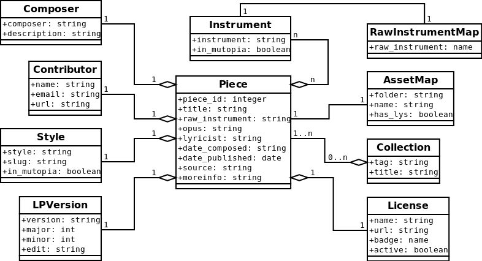

Mutopia Database Design
=======================

.. include:: ../subs.txt

This section is an overview of the database design with a brief
description of the data dictionary.

Design Details
--------------

The best start to a discussion on design is an entity relationship diagram.

The classes in the diagram shadow the model defined for this project
and detailed information can be found in the :doc:`../modules/mutopia`
documentation. Each class in this diagram is derived from the |django|
``Model`` class and thus corresponds to a table in the database. The
``Model`` class also provides maitenance functionality so, for
example, if you were to instantiate a ``Composer`` class, set
``composer`` and ``description``, then save it (``Composer.save()``),
it will be stored in the database.

Most of these entities should look familiar to you (``Style``,
``Instrument``), but there are some that have been created to either
solve a specific problem relating to updating or material
presentation. Here is a short data dictionary of the entities in the
diagram:

.. glossary::

   Composer
       The author of a piece of music with a description detailing the
       full name and lifespan. The information taken from the *composer* field
       of the RDF must match a composer in this table.

   Contributor
       Also known as a maintainer, this is the person who transcribed
       the music. The object is built by the three fields,
       *maintainer*, *maintainerEmail*, and *maintainerWeb*.

   Style
       The style of the piece. The slug is used to adapt the style
       name to something that is suitable for representing in a URL.

   LPVersion
       The version of the |lilypond| compiler used for the
       transcription of this piece. This is broken down into its
       constituent parts for ease of searching.

   Instrument
       The predefined set of known instruments; the *in_mutopia* flag
       is used to mark instruments the original set.

   License
       A copyright definition, the *name* field of which is matched
       from the *license* field of the RDF. The *badge* attribute is
       used to reference a graphic for presentation purposes. The
       *active* attribute may be used to deprecate the use of older
       licenses.

   Collection
       A container for a group of related pieces. It is possible for a
       piece to be in more than one collection. The tag is used to
       locate related information in the data store. A ``Collection``
       is not related to ``Piece`` updates but is manually added at
       the request of contributors.

   The Asset Map
        Looking at the diagram you can see that an ``AssetMap`` has a 1:1
        relationship with a ``Piece``; for each ``Piece`` entity there exists
        exactly one ``AssetMap`` entity. This ``AssetMap`` is used to associate
        the physical assets, its PDF and MIDI files, with the owning
        ``Piece``.

        When a new piece is published, an ``AssetMap`` is created by
        determining the location of the RDF for a new or updated piece of
        music. The ``folder`` and ``name`` attributes are set, and the
        ``has_lys`` is set to true if this is a large piece defined by several
        |lilypond| files. The RDF file location is determined from these
        attributes and is read to create all the necessary components to form
        a new ``Piece`` which then gets associated with the new ``AssetMap``.

        When an existing piece is updated, the ``AssetMap`` is found and the
        update process will load the RDF and follow the assocation to the
        ``Piece`` to make updates.

        The ``AssetMap`` provides enough naming information to not only find
        the RDF but also to discover all other assets that were created when the
        piece was published.

   The Raw Instrument Map
        Some objects map be created during this process as a side effect. For
        example, if a |lilypond| version is used to transcribe a piece, the
        lookup for that will fail and a new ``LPVersion`` entity is created.
        The ``Instrument`` objects take a little more work because we want to
        define a known set of instruments and while we direct the users to
        select from this list of known instruments, it is still data that is
        allowed to be somewhat loose. Some examples,

          * Plurals: 'two pianos' should form a single association to 'Piano'.
          * Idioms: 'Uke' is not a known instrument but 'Ukulele' is.
          * Language: 'Guitarre' needs to be translated to 'Guitar'

        Each instance of a ``RawInstrumentMap`` contains an instrument name
        that is associated with one of our known instruments (an
        ``Instrument`` instance.) When the RDF is read, the header field named
        *for* is read directly into the ``Piece.raw_instrument`` field so it
        can be tokenized and scanned for any instrument relationships.

        .. note:: The "for" field is stored in the ``Piece`` so that
                  the piece's instrument associations can be rebuilt
                  at any time. This allows for the development of an
                  improved algorithm for parsing this part of the RDF.
