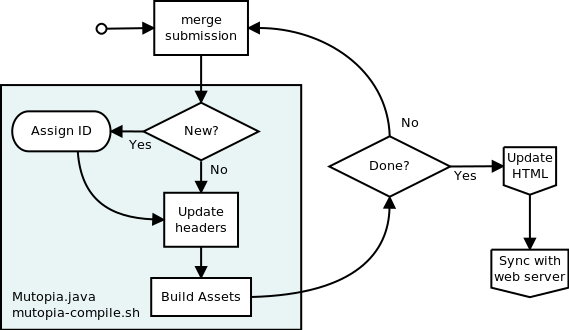

Mutopia Publication
===================

.. include:: subs.txt

Historical Overview
-------------------

These are the major tasks in the process of publishing a submission to
the Mutopia Project catalog:

  * Building the assets from source.

  * Updating the website.

  * Synchronizing the local workspace with the web server.

Several submissions can be processed before updating the website. The
flow looks something like this,

Some notes on this flow chart:

  * Merging submissions is a GIT task.

  * Assigning an ID, updating headers,and asset building are done
    using a combination of java application and shell script.

  * Updating the HTML is done via a perl script (``Update_website.pl``)
    that,

    - rebuilds the data and search caches

    - rebuilds all HTML files

  * Synchronizing is a separate operation, typically done with a tool
    like ``rsync``.

This works great because the MutopiaProject website is static HTML and
the caches are read-only. Everything is built off-line so the speed is
reasonable. Problems arise when,

  * Diacritical search is desired or you want to expand search
    functionality outside the capabilities of the cache design.

  * When you want to start tracking download counts for the purpose of
    popularity metrics.

  * The cache design causes an excessive burden on the server.

Database-driven Publication
---------------------------

The effort for a database started when I wanted a reasonable way to do
*ad hoc* queries --- I wanted to be able to mine information from our
archive for the purpose of maintenance. The first attempts at doing
this with the cache files were frustrating because I needed to write
code for each bit of information I wanted to draw out of the files. I
started looking at the RDF files, generated as part of the publication
phase, and found that if the data in the RDF file were in a database
that I could query I would have what I want. Once I had the schema
designed, it was very little work to get the |django| :abbr:`ORM
(Object Relationshiop Model)` to reflect the database design.

Why do this?
~~~~~~~~~~~~

Since we have a static web site and data access is read-only, what
exactly is the advantage of using |django| and a database? There are a
number of reasons,

  * Performance

    - Database access on a server is nicely balanced for multiple
      connections accessing data in a shared fashion.

    - There are tuning opportunities at the server level, as well as
      support in |django| for caching and static file serving.

    - Creates an easy path to separating catalog searching from data
      storage, which is how the |heroku| demo server works now
      with the database on |heroku| and the physical pieces on
      ``MutopiaProject.org``.

  * Convenience

    - Takes one step out of the process flow (the mass building of
      static HTML files).

    - Allows *ad hoc* queries on the database itself (without |django|) and
      an easy path to scripts that could use the |django| frameworks
      to access the data.

    - Nice templating system that supports inheritance to reduce code
      duplication.

  * Ease of development

    - Lots of current libraries and tools to support |django| and its
      deployment to a server. Its :abbr:`ORM (Object Relationshiop
      Model)` makes it easy to query data without writing SQL.

    - |postgres| is a well-respected high-performance database
      package that is popular on servers.

    - Python is a good base tool for all our tools and should attract
      volunteers.

Mixing the old with the new
~~~~~~~~~~~~~~~~~~~~~~~~~~~

With the |django| mutopia app, the HTML pages are generated with
templates whose creation is triggered by the URL definitions that are
created during the development process. Python and :abbr:`WSGI (Web
Server Gateway Interface)` are now driving the web site and our
process flow no longer needs the ``Update HTML`` step but requires a
database update after synchronizing with the data server:

The second step is updating the database to reflect the newly
published pieces, which is accomplished by the ``dbupdate`` management
command. This process has the following flow:

The |githubapi| is used only to preserve the current model of building the
assets and getting them to the dataserver. A future revision might
have the publication process update the ``AssetMap`` with the name of
the RDF it just created and a null ``Piece`` reference.
